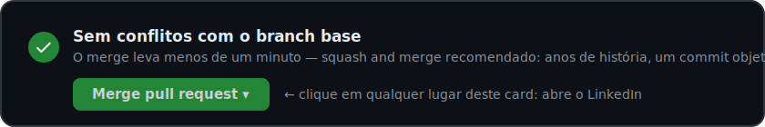

  

`💬 Conversa` · `📝 Commits (3)` · `✅ Checks (4)` · `📁 Arquivos alterados (2)`

 

## 💬 Conversa

> **barbaro-br** comentou — *autor deste PR*

Este pull request adiciona um **desenvolvedor backend júnior** ao seu time — Java, Spring Boot e PostgreSQL, com uma particularidade: antes de escrever código, passei anos **vendendo**. Hoje construo os sistemas que sustentam vendas.

**Por que aceitar este merge:** não sou dev de tutorial. Meu principal projeto é um sistema completo pra uma hamburgueria de verdade — cliente real, pedidos reais, regra de negócio real, indo pra produção. E a experiência de vendas veio junto no pacote: quem já negociou cara a cara com cliente difícil não tem medo de requisito mal escrito.

 

## 📁 Arquivos alterados

  

 

## 📝 Commits

 

## ✅ Checks

  

 

## 📋 Checklist de review

- [x] Sabe modelar banco de dados? *— schema de 11 tabelas escrito à mão, versionado com Flyway*
- [x] Escreve API que outro dev entende? *— contract-first: o contrato nasce antes do código*
- [x] Aguenta pressão e cliente difícil? *— sobrevivi a anos de vendas; a daily é moleza*
- [x] Continua aprendendo? *— JPA a fundo, arquitetura de software e boas práticas REST, todo dia*
- [ ] Faz parte do seu time? *— esse checkbox é seu* 👇

 

## 🔗 Issues vinculadas

> **Closes `#404`** — *"vaga de backend júnior não encontrada"* · aberto por **barbaro-br** · label: `remoto ou presencial`

 

## ✅ Merge pull request

  

