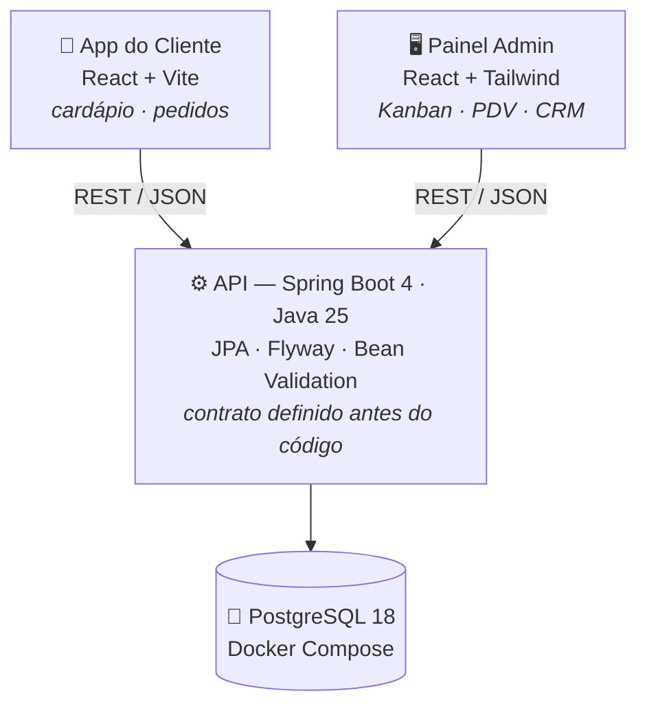

<div align="center">



<br><br>

# Montalvão API — Documentação Oficial

**Base URL:** `github.com/barbaro-br` · **Versão:** `2.0` · **Ambiente:** produção

*Esta não é uma API de mock. Todos os endpoints retornam dados reais.*

</div>

<br>

## `GET /sobre`

**`200 OK`**

```json
{
  "nome": "Francisco Montalvão",
  "cargo": "Backend Developer",
  "stack_principal": ["Java", "Spring Boot", "PostgreSQL"],
  "formacao": "Engenharia de Software",
  "base": "Montalvânia — MG, Brasil",
  "historia": "Passei anos vendendo. Hoje construo os sistemas que sustentam vendas."
}
```

> ⚠️ **BREAKING CHANGE na v2.0** — migração completa de vendas para engenharia de software.
> Não foi acidente, foi deploy planejado. As skills de cliente da v1 foram portadas: quem já
> negociou com cliente difícil não tem medo de requisito mal escrito.

<br>

## `GET /projetos/mestre-do-sabor` ⭐

**`200 OK`** — *projeto em destaque*

Sistema completo para uma hamburgueria real — cliente de verdade, pedidos de verdade, regras de negócio de verdade. Não é projeto de tutorial: é software indo pra produção.

> 🔒 Repositório privado (projeto comercial com cliente real). Demonstração, prints e walkthrough do código disponíveis sob pedido — só chamar no [`POST /contato`](#post-contato).



**Decisões de engenharia que eu defendo em entrevista:**

| Decisão | Por quê |
|---|---|
| 🔒 Zero trust no cliente | Backend recalcula todos os totais — o front nunca dita preço |
| 📸 Pedido é snapshot | Endereço e preços congelados no momento da compra: histórico imutável |
| 🗃️ Migrations versionadas (Flyway) | Schema com 11 tabelas escrito à mão, constraint por constraint |
| 🧱 Domínio rico | Entities com validação e comportamento — sem setters anêmicos, sem Lombok |
| 📜 Contract-first | API documentada antes da primeira linha de código; front e back evoluem sem surpresa |

**Roadmap:**

- [x] Modelagem do banco + migrations (Flyway)
- [x] Docker Compose gerenciado pela aplicação
- [x] Domínios Settings e Category — CRUD completo, validações, `409`/`404` semânticos
- [ ] Customer · Product · Order *(em andamento)*
- [ ] Autenticação JWT com Spring Security
- [ ] Deploy em VPS: Caddy + Docker + backups automatizados com `pg_dump`

<br>

## `GET /projetos`

**`200 OK`** — `Content-Range: 1-3/*` *(coleção em crescimento)*

**[backend-challenges](https://github.com/barbaro-br/backend-challenges)**
Repositório de desafios práticos organizados por nível: Júnior → Pleno → Sênior, em qualquer linguagem. A ideia: aprender fazendo, não só lendo.

**[Gerenciador de Produtos](https://github.com/barbaro-br/backend-challenges-desafio-gerenciador-de-produtos)**
API REST completa com CRUD de produtos e categorias, validações, exceções customizadas e boas práticas REST. `Java 21 · Spring Boot · PostgreSQL · Docker`

**[Customer Loans API](https://github.com/barbaro-br/loans)**
Motor de elegibilidade para modalidades de empréstimo, com regras de negócio por renda, idade e localização. `Java 21 · Spring Boot · Bean Validation`

<br>

## `GET /stack`

**`200 OK`**

<div align="center">


</div>

<br>

## `GET /vagas/backend-junior`

**`404 Not Found`**

```json
{
  "erro": "recurso ainda não encontrado",
  "detalhe": "buscando a primeira vaga como desenvolvedor backend — remoto ou presencial",
  "enquanto_isso": [
    "construindo backend real em produção para cliente real (Mestre do Sabor)",
    "estudando arquitetura de software, JPA a fundo e boas práticas REST"
  ],
  "resolucao_sugerida": "esse 404 vira 200 com um POST /contato 👇"
}
```

<br>

## `POST /contato`

**`202 Accepted`** — *rate limit: nenhum · tempo de resposta: rápido*

<div align="center">

[](https://www.linkedin.com/in/francisco-montalvao-76a1a090/)
[](mailto:f.montalvao@outlook.com)

</div>

<br>

## `GET /rate-limit`

**`429 Too Many Requests`** — *todo sistema precisa de janela de recarga:*

| Recurso | Função no sistema |
|---|---|
| ⚽ Futebol | Melhor que qualquer standup |
| 🚴 Ciclismo | Debug em movimento |
| 📚 Leitura | Refatorando o sistema operacional |
| 🧘 Estoicismo | Tratamento de exceções da vida real |

<br>

## `CHANGELOG.md`

```
[2.0.0] BREAKING CHANGE: migração de vendas para engenharia de software
[1.x.x] anos lidando com cliente na vida real — feature portada para a v2
[0.1.0] init: primeiro "Hello, World"
```

<br>

<div align="center">

`// Status: 🟢 em desenvolvimento ativo. Como todo bom software.`

</div>
